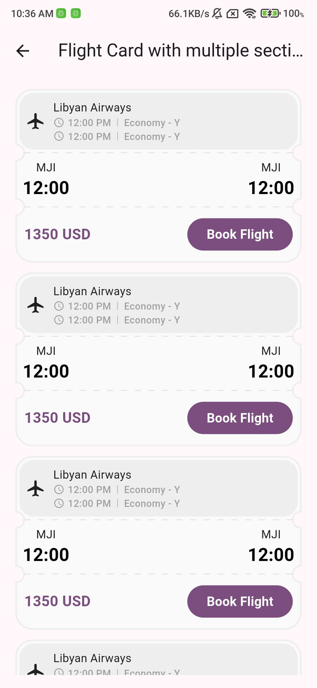

<!--
This README describes the package. If you publish this package to pub.dev,
this README's contents appear on the landing page for your package.

For information about how to write a good package README, see the guide for
[writing package pages](https://dart.dev/tools/pub/writing-package-pages).

For general information about developing packages, see the Dart guide for
[creating packages](https://dart.dev/guides/libraries/create-packages)
and the Flutter guide for
[developing packages and plugins](https://flutter.dev/to/develop-packages).
-->

# Ticketcher

A Flutter widget that creates beautiful, customizable ticket-style UI components with various border patterns, dividers, and styling options.

## Preview

|  |  |  |  |
|:---:|:---:|:---:|:---:|
| *Multi-section Flight Ticket* | *Gradient Color Ticket* | *Wave Border Ticket* | *Sharp Border Ticket* |

## Features

### Basic Usage

```dart
Ticketcher(
  sections: [
    Section(
      child: Text('First Section'),
    ),
    Section(
      child: Text('Second Section'),
    ),
    Section(
      child: Text('Third Section'),
    ),
  ],
)
```

### Border Radius

Customize the corners of your ticket with different radius styles and directions.

```dart
Ticketcher(
  decoration: TicketcherDecoration(
    borderRadius: TicketRadius(
      radius: 8.0,
      direction: RadiusDirection.inward, // or outward
      corner: TicketCorner.all, // or specific corners
    ),
  ),
)
```

Available corner options:
- `TicketCorner.all`: Rounds all corners
- `TicketCorner.top`: Rounds only top corners
- `TicketCorner.bottom`: Rounds only bottom corners
- `TicketCorner.topLeft`: Rounds only top-left corner
- `TicketCorner.topRight`: Rounds only top-right corner
- `TicketCorner.bottomLeft`: Rounds only bottom-left corner
- `TicketCorner.bottomRight`: Rounds only bottom-right corner
- `TicketCorner.none`: No rounded corners

### Border Patterns

Add decorative patterns to the bottom edge of your ticket.

```dart
Ticketcher(
  decoration: TicketcherDecoration(
    bottomBorderStyle: BorderPattern(
      shape: BorderShape.wave, // or sharp, arc
      height: 8.0,
      width: 20.0,
    ),
  ),
)
```

Available patterns:
- `BorderShape.wave`: Creates a wavy pattern
- `BorderShape.sharp`: Creates a zigzag pattern
- `BorderShape.arc`: Creates a series of connected arcs

### Dividers

Add dividers between sections.

```dart
Ticketcher(
  decoration: TicketcherDecoration(
    divider: TicketDivider(
      color: Colors.grey,
      thickness: 1.0,
      style: DividerStyle.solid, // or dashed
    ),
  ),
)
```

For dashed dividers:
```dart
Ticketcher(
  decoration: TicketcherDecoration(
    divider: TicketDivider.dashed(
      color: Colors.grey,
      thickness: 1.0,
      dashWidth: 10.0,
      dashSpace: 7.0,
    ),
  ),
)
```

### Background Styling

#### Solid Color
```dart
Ticketcher(
  decoration: TicketcherDecoration(
    backgroundColor: Colors.white,
  ),
)
```

#### Gradient
```dart
Ticketcher(
  decoration: TicketcherDecoration(
    gradient: LinearGradient(
      colors: [Colors.blue, Colors.purple],
      begin: Alignment.topLeft,
      end: Alignment.bottomRight,
    ),
  ),
)
```

### Border

Add a border around your ticket.

```dart
Ticketcher(
  decoration: TicketcherDecoration(
    border: Border.all(
      color: Colors.grey,
      width: 1.0,
    ),
  ),
)
```

### Shadow

Add a shadow effect to your ticket.

```dart
Ticketcher(
  decoration: TicketcherDecoration(
    shadow: BoxShadow(
      color: Colors.black.withOpacity(0.2),
      blurRadius: 4.0,
      offset: Offset(0, 2),
    ),
  ),
)
```

### Section Padding

Customize the padding for each section.

```dart
Ticketcher(
  sections: [
    Section(
      child: Text('First Section'),
      padding: EdgeInsets.all(16.0),
    ),
    Section(
      child: Text('Second Section'),
      padding: EdgeInsets.all(16.0),
    ),
    Section(
      child: Text('Third Section'),
      padding: EdgeInsets.all(16.0),
    ),
  ],
)
```

### Width Control

Set a specific width for your ticket.

```dart
Ticketcher(
  width: 300.0,
  // ... other properties
)
```

### Notch Radius

Customize the radius of the notches that connect the sections.

```dart
Ticketcher(
  notchRadius: 10.0,
  // ... other properties
)
```

## Complete Example

Here's a complete example showcasing multiple features with three sections:

```dart
Ticketcher(
  width: 300.0,
  notchRadius: 10.0,
  sections: [
    Section(
      child: Text('Header Section'),
      padding: EdgeInsets.all(16.0),
    ),
    Section(
      child: Text('Content Section'),
      padding: EdgeInsets.all(16.0),
    ),
    Section(
      child: Text('Footer Section'),
      padding: EdgeInsets.all(16.0),
    ),
  ],
  decoration: TicketcherDecoration(
    borderRadius: TicketRadius(
      radius: 8.0,
      direction: RadiusDirection.inward,
      corner: TicketCorner.all,
    ),
    gradient: LinearGradient(
      colors: [Colors.blue, Colors.purple],
      begin: Alignment.topLeft,
      end: Alignment.bottomRight,
    ),
    divider: TicketDivider.dashed(
      color: Colors.white,
      thickness: 1.0,
      dashWidth: 10.0,
      dashSpace: 7.0,
    ),
    bottomBorderStyle: BorderPattern(
      shape: BorderShape.wave,
      height: 8.0,
      width: 20.0,
    ),
    shadow: BoxShadow(
      color: Colors.black.withOpacity(0.2),
      blurRadius: 4.0,
      offset: Offset(0, 2),
    ),
  ),
)
```

## Real-world Example

Here's a practical example of a flight ticket with multiple sections:

```dart
Ticketcher(
  decoration: TicketcherDecoration(
    borderRadius: TicketRadius(radius: 20, corner: TicketCorner.all),
    backgroundColor: Colors.grey.shade50,
    border: Border.all(color: Colors.grey.shade200, width: 2),
    divider: TicketDivider.dashed(
      color: Colors.grey.shade300,
      thickness: 1,
      dashWidth: 8,
      dashSpace: 0.01,
    ),
  ),
  sections: [
    // Header section with airline info
    Section(
      padding: EdgeInsets.all(4),
      child: Column(
        children: [
          Container(
            decoration: BoxDecoration(
              borderRadius: BorderRadius.circular(18),
              color: Colors.grey.shade200,
            ),
            child: Padding(
              padding: const EdgeInsets.all(8.0),
              child: Row(
                children: [
                  Icon(Icons.airplanemode_active),
                  SizedBox(width: 10),
                  Column(
                    crossAxisAlignment: CrossAxisAlignment.start,
                    children: [
                      Text("Airline Name"),
                      Text("Flight Details"),
                    ],
                  ),
                ],
              ),
            ),
          ),
        ],
      ),
    ),
    // Flight details section
    Section(
      padding: EdgeInsets.all(8),
      child: Row(
        mainAxisAlignment: MainAxisAlignment.spaceBetween,
        children: [
          Column(
            children: [
              Text("Departure"),
              Text("Time"),
            ],
          ),
          Column(
            children: [
              Text("Arrival"),
              Text("Time"),
            ],
          ),
        ],
      ),
    ),
    // Footer section with price and action
    Section(
      padding: EdgeInsets.all(10),
      child: Row(
        mainAxisAlignment: MainAxisAlignment.spaceBetween,
        children: [
          Text("Price"),
          FilledButton(
            onPressed: () {},
            child: Text("Book Now"),
          ),
        ],
      ),
    ),
  ],
)
```

## Best Practices

1. **Gradient Usage**: When using gradients, ensure good contrast with your content text.
2. **Border Patterns**: Choose border patterns that complement your overall design.
3. **Notch Radius**: Keep the notch radius proportional to your ticket's size.
4. **Padding**: Use consistent padding values for a polished look.
5. **Shadow**: Use subtle shadows to create depth without overwhelming the design.

## Contributing

Feel free to contribute to this project by submitting issues or pull requests.

## Getting Started

Add this to your package's `pubspec.yaml` file:

```yaml
dependencies:
  ticketcher: ^1.0.0
```

You can then import the package:

```dart
import 'package:ticketcher/ticketcher.dart';
```

## Additional Information

For more examples and use cases, check out the `example` directory in the package repository.
