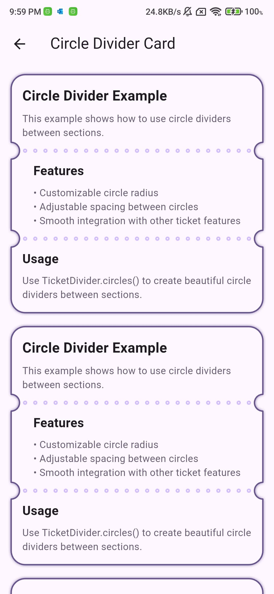
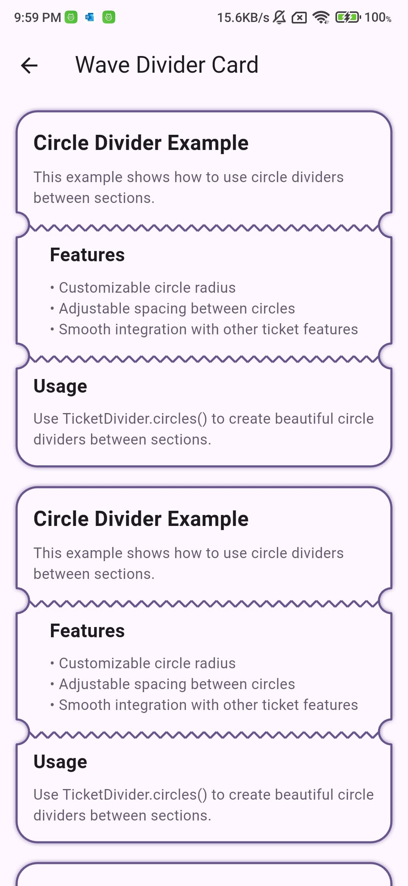
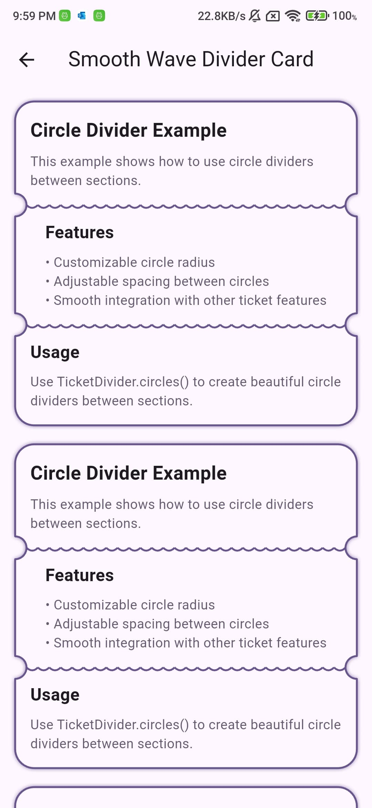
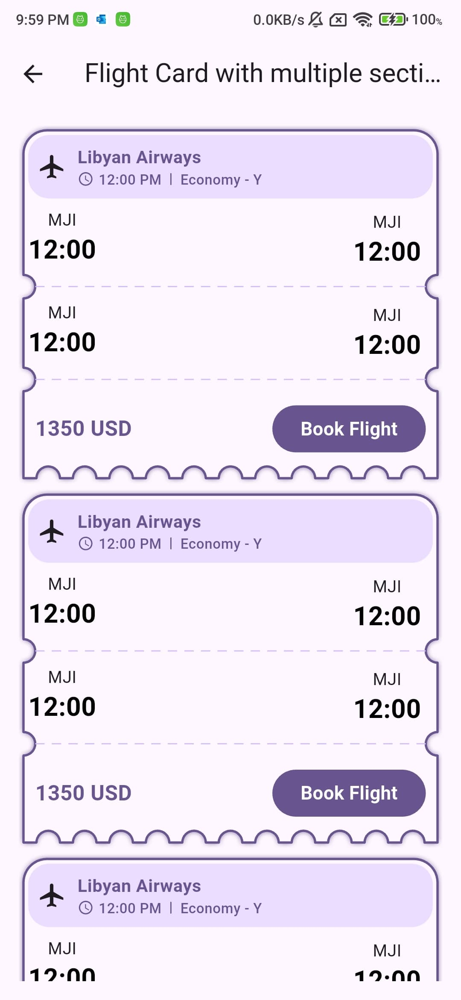
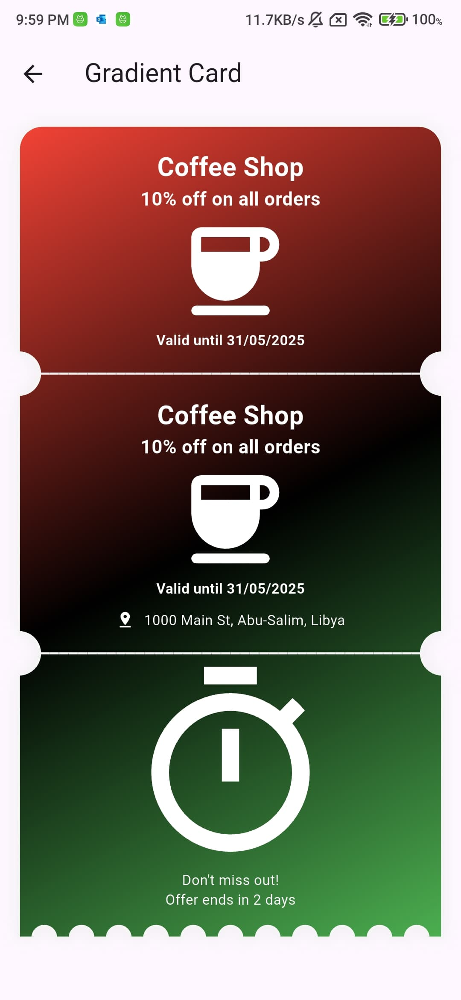

<!--
This README describes the package. If you publish this package to pub.dev,
this README's contents appear on the landing page for your package.

For information about how to write a good package README, see the guide for
[writing package pages](https://dart.dev/tools/pub/writing-package-pages).

For general information about developing packages, see the Dart guide for
[creating packages](https://dart.dev/guides/libraries/create-packages)
and the Flutter guide for
[developing packages and plugins](https://flutter.dev/to/develop-packages).
-->

# Ticketcher

A Flutter package for creating beautiful ticket-style cards with customizable borders, dividers, and patterns.

|  |  |  |  |  |
|:---:|:---:|:---:|:---:|:---:|
|  |  |  |  |

## Features

- Create both vertical and horizontal ticket layouts
- Customizable border patterns (wave, arc, sharp)
- Multiple divider styles (solid, dashed, circles, wave, smooth wave)
- Gradient backgrounds
- Custom border radius for any corner
- Shadow effects
- Section padding control
- Width and height control
- Notch radius customization

## Installation

Add this to your package's `pubspec.yaml` file:

```yaml
dependencies:
  ticketcher: ^1.0.0
```

## Usage

### Basic Usage

The default mode is vertical. Here's a basic example:

```dart
Ticketcher(
  sections: [
    Section(
      child: Text('First Section'),
    ),
    Section(
      child: Text('Second Section'),
    ),
  ],
)
```

### Horizontal Mode

For horizontal layout, use the `horizontal` constructor:

```dart
Ticketcher.horizontal(
  height: 160,
  sections: [
    Section(
      widthFactor: 1,
      child: Text('Left Section'),
    ),
    Section(
      widthFactor: 2,
      child: Text('Right Section'),
    ),
  ],
)
```

### Vertical Mode

For vertical layout, you can use either the default constructor or the explicit `vertical` constructor:

```dart
Ticketcher.vertical(
  sections: [
    Section(
      child: Text('Top Section'),
    ),
    Section(
      child: Text('Bottom Section'),
    ),
  ],
)
```

### Border Patterns

Add decorative patterns to the edges of your ticket.

```dart
Ticketcher(
  decoration: TicketcherDecoration(
    bottomBorderStyle: BorderPattern(
      shape: BorderShape.wave, // or sharp, arc
      height: 8.0,
      width: 20.0,
    ),
  ),
)
```

Available patterns:
- `BorderShape.wave`: Creates a wavy pattern
- `BorderShape.sharp`: Creates a zigzag pattern
- `BorderShape.arc`: Creates a series of connected arcs

### Dividers

Add dividers between sections with various styles.

```dart
Ticketcher(
  decoration: TicketcherDecoration(
    divider: TicketDivider(
      color: Colors.grey,
      thickness: 1.0,
      style: DividerStyle.solid, // or dashed, circles, wave, smoothWave
    ),
  ),
)
```

#### Solid Divider
```dart
Ticketcher(
  decoration: TicketcherDecoration(
    divider: TicketDivider.solid(
      color: Colors.grey,
      thickness: 1.0,
    ),
  ),
)
```

#### Dashed Divider
```dart
Ticketcher(
  decoration: TicketcherDecoration(
    divider: TicketDivider.dashed(
      color: Colors.grey,
      thickness: 1.0,
      dashWidth: 10.0,
      dashSpace: 7.0,
    ),
  ),
)
```

#### Circle Divider
```dart
Ticketcher(
  decoration: TicketcherDecoration(
    divider: TicketDivider.circles(
      color: Colors.grey,
      thickness: 2.0,
      circleRadius: 4.0,
      circleSpacing: 8.0,
    ),
  ),
)
```

#### Wave Divider
```dart
Ticketcher(
  decoration: TicketcherDecoration(
    divider: TicketDivider.wave(
      color: Colors.grey,
      thickness: 2.0,
      waveHeight: 6.0,
      waveWidth: 12.0,
    ),
  ),
)
```

#### Smooth Wave Divider
```dart
Ticketcher(
  decoration: TicketcherDecoration(
    divider: TicketDivider.smoothWave(
      color: Colors.grey,
      thickness: 2.0,
      waveHeight: 6.0,
      waveWidth: 12.0,
    ),
  ),
)
```

### Background Styling

#### Solid Color
```dart
Ticketcher(
  decoration: TicketcherDecoration(
    backgroundColor: Colors.white,
  ),
)
```

#### Gradient
```dart
Ticketcher(
  decoration: TicketcherDecoration(
    gradient: LinearGradient(
      colors: [Colors.blue, Colors.purple],
      begin: Alignment.topLeft,
      end: Alignment.bottomRight,
    ),
  ),
)
```

### Border

Add a border around your ticket.

```dart
Ticketcher(
  decoration: TicketcherDecoration(
    border: Border.all(
      color: Colors.grey,
      width: 1.0,
    ),
  ),
)
```

### Shadow

Add a shadow effect to your ticket.

```dart
Ticketcher(
  decoration: TicketcherDecoration(
    shadow: BoxShadow(
      color: Colors.black.withOpacity(0.2),
      blurRadius: 4.0,
      offset: Offset(0, 2),
    ),
  ),
)
```

### Section Padding

Customize the padding for each section.

```dart
Ticketcher(
  sections: [
    Section(
      child: Text('First Section'),
      padding: EdgeInsets.all(16.0),
    ),
    Section(
      child: Text('Second Section'),
      padding: EdgeInsets.all(16.0),
    ),
  ],
)
```

### Width Control

Set a specific width for your ticket.

```dart
Ticketcher(
  width: 300.0,
  // ... other properties
)
```

### Notch Radius

Customize the radius of the notches that connect the sections.

```dart
Ticketcher(
  notchRadius: 12.0,
  // ... other properties
)
```

## Important Usage Notes

### Assertions

The package includes several assertions to prevent invalid configurations:

1. **Minimum Sections**
   - Both vertical and horizontal tickets must have at least 2 sections
   - Error message: "Vertical/Horizontal Ticketcher must have at least 2 sections"

2. **Border Style and Radius Conflicts**
   - In vertical mode, you cannot use `bottomBorderStyle` when there's a bottom border radius
   - Error message: "Cannot use bottomBorderStyle when there is a bottom border radius"
   - This applies to any bottom corner radius (bottom, bottomLeft, bottomRight, or all corners)

### Best Practices

1. **Section Width Factors**
   - In horizontal mode, use `widthFactor` to control section widths
   - The total of all width factors determines the relative sizes
   - Example: `widthFactor: 1` and `widthFactor: 2` creates a 1:2 ratio

2. **Border Patterns**
   - Border patterns work best with straight edges
   - Avoid using border patterns on edges with rounded corners
   - For best results, use patterns on edges without radius

3. **Dividers**
   - Choose divider styles that complement your border patterns
   - Consider using matching colors for borders and dividers
   - Adjust thickness and spacing for better visual balance

4. **Performance**
   - Use `width` and `height` properties when you know the exact dimensions
   - This helps avoid unnecessary layout calculations
   - For dynamic content, let the widget calculate its own size

## Examples

Check out the [example](example) directory for more detailed examples of different ticket styles and configurations.

## Contributing

Contributions are welcome! Please feel free to submit a Pull Request.

## License

This project is licensed under the MIT License - see the [LICENSE](LICENSE) file for details.
